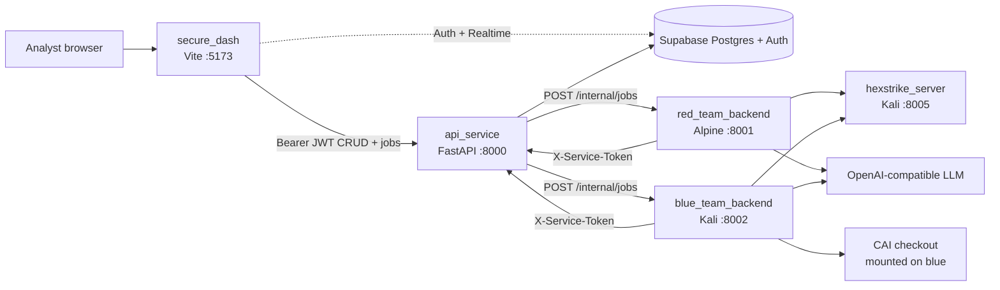
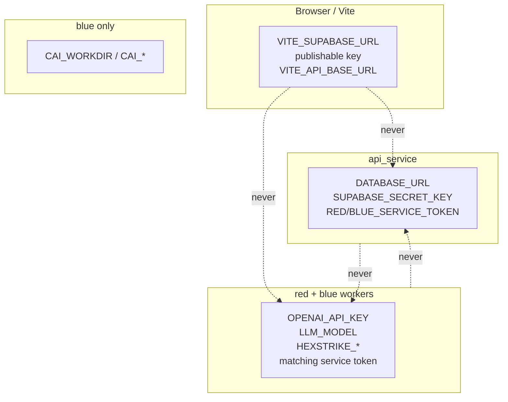
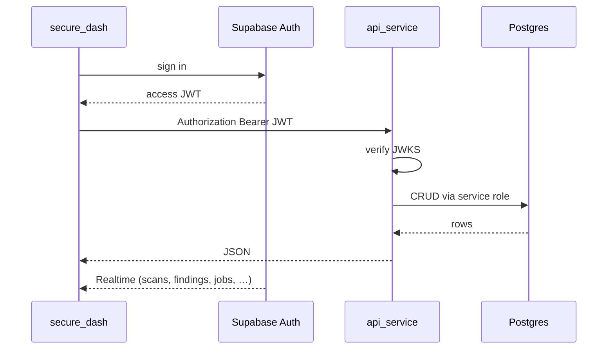
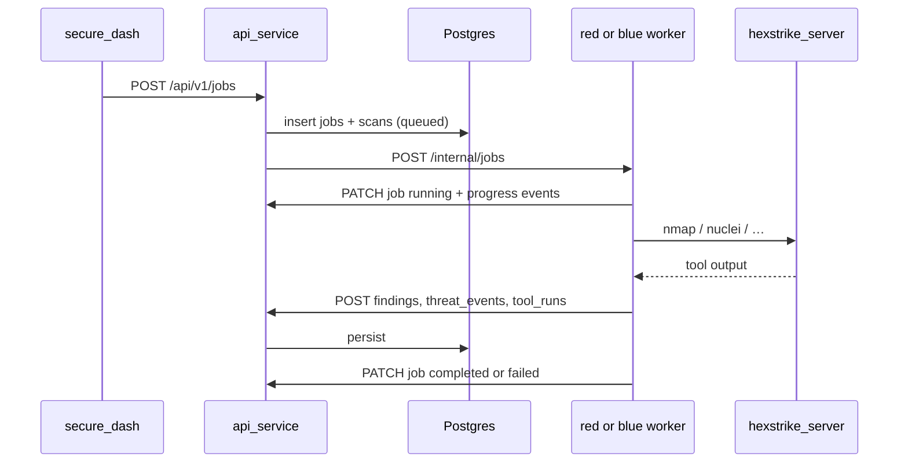

# Architecture

AI Dhal is a lab monorepo. **`api_service` is the only process that talks to Postgres.** The UI authenticates with Supabase and sends JWTs to the API. Red and blue workers run tools (HexStrike, optional CAI) and report results back through the API with service tokens.

## System context



## Service map

| Service | Image / runtime | Host port | May touch DB? | Responsibility |
|---------|-----------------|-----------|---------------|----------------|
| `secure_dash` | Node 20+, TanStack Start / Vite | **5173** | No (Auth + Realtime only) | Analyst UI. All business CRUD via API. |
| `api_service` | `python:3.12-slim` | **8000** | **Yes — only writer** | JWT/JWKS + service-token AuthZ, CRUD, job dispatch |
| `red_team_backend` | `python:3.12-alpine` | **8001** | No | Surface recon, task discovery, HexStrike MCP/HTTP |
| `blue_team_backend` | `kalilinux/kali-rolling` | **8002** | No | Vuln scan, monitor, patches, live CAI chat |
| `hexstrike_server` | Kali + security tools | **8005** | No | nmap, nuclei, gobuster, and other tool HTTP/MCP |

UI is **not** in Compose. Run it on the host (`cd secure_dash && npm run dev`).

## Secret placement



| Secret | API | Red | Blue | UI |
|--------|:---:|:---:|:----:|:--:|
| `DATABASE_URL` / `SUPABASE_SECRET_KEY` | yes | no | no | **no** |
| Publishable Supabase key | no | no | no | yes |
| `RED_SERVICE_TOKEN` | yes | yes | no | no |
| `BLUE_SERVICE_TOKEN` | yes | no | yes | no |
| `OPENAI_API_KEY` / `LLM_MODEL` | **no** | yes | yes | no |
| `HEXSTRIKE_*` | no | yes | yes | no |
| `CAI_*` | no | disabled | yes | no |

## Repository layout

```text
ai_dhal/
├── docker-compose.yml          # API, red, blue, hexstrike
├── api_service/                # FastAPI CRUD + job orchestration
├── red_team_backend/           # Alpine worker
├── blue_team_backend/          # Kali worker + CAI
├── hexstrike_server/           # HexStrike MCP/API
├── secure_dash/                # Analyst UI
│   └── supabase/migrations/    # Postgres schema (source of truth)
├── docs/                       # This documentation
├── specs/                      # Feature specs (001–004)
└── scripts/                    # migrations, bootstrap, smoke checks
```

## Compose vs native URLs

| Setting | Docker Compose | Native (host processes) |
|---------|----------------|-------------------------|
| `RED_WORKER_URL` | `http://red_team_backend:8001` | `http://localhost:8001` |
| `BLUE_WORKER_URL` | `http://blue_team_backend:8002` | `http://localhost:8002` |
| `HEXSTRIKE_BASE_URL` | `http://hexstrike_server:8005` | `http://localhost:8005` |
| API from workers | `http://api_service:8000/api/v1` | `http://localhost:8000/api/v1` |
| UI → API | Vite proxy `/api` → `127.0.0.1:8000` | same |

## Request flows

### A. Analyst CRUD



### B. Start a red or blue job



### C. Task-driven tool unlock

Managers create **tasks** (red or blue). An analyst with an `in_progress` task of that type may open `/tools/red` or `/tools/blue`. Managers always can. Admins cannot open tools.

Starting a tool run from a task may set `tasks.linked_job_id` → `jobs.id`. Live progress is written to `job_progress_events`.

### D. Blue CAI chat

Interactive CAI (`uv run cai`) runs **inside the blue container**. The API proxies SSE; secrets stay on the worker. Red CAI is disabled (Alpine image).

```text
UI ──JWT──► API /cai-chat ──service token──► blue /tools/blue ──► uv run cai
```

## Pipelines

| Team | Profile / pipeline | Typical tools | Writes |
|------|--------------------|---------------|--------|
| Red | `surface-recon` | HexStrike nmap (and related) | findings, threat_events, tool_runs |
| Red | `task-discovery` | HexStrike chain → attack_chain_steps | chains + steps (`category`, `source_tool`, `evidence`) |
| Red | `deep-emulation` | LLM plan (CAI disabled on red) | chain-shaped plan + events |
| Blue | `vuln_scan` | HexStrike nuclei / similar | findings (`team=blue`) |
| Blue | `monitor` | poll / alert adapters | threat_events |
| Blue | `patch` | playbook apply | patches + finding `remediated` |

Live HexStrike (`HEXSTRIKE_STUB=0`) **fails closed** if the server is down. Stub mode is for CI/offline only.

Safety: `DEMO_SAFE_MODE=1` + `TARGET_ALLOWLIST` — out-of-scope targets emit `blocked_by_guardrail` events and must not run exploit tools.

## AuthN / AuthZ

| Principal | How | Allowed |
|-----------|-----|---------|
| Analyst / Manager / Admin / User | `Authorization: Bearer <Supabase JWT>` (JWKS) | Role-scoped CRUD; see [data model RBAC](data-model.md#rbac) |
| Red worker | `X-Service-Token: RED_SERVICE_TOKEN` | Insert/update findings, events, chains, tool_runs, job/scan progress |
| Blue worker | `X-Service-Token: BLUE_SERVICE_TOKEN` | Same for blue team + patches |
| Browser PostgREST | publishable key | SELECT only on operational tables (writes revoked) |

Service tokens cannot delete assets or change `user_roles`. Admin bootstrap is out-of-band: `scripts/bootstrap_admin.py`.

## UI routes (`secure_dash`)

| Route | Purpose |
|-------|---------|
| `/auth` | Sign in |
| `/` | Dashboard KPIs |
| `/scans` | Scan list / launch jobs |
| `/threats` | Threat events |
| `/attack-chain` | Kill-chain visualization |
| `/patches` | Blue remediation |
| `/tasks`, `/tasks/:taskId` | Task board and detail |
| `/tools/red`, `/tools/blue` | Live tools + CAI (role + task unlock) |
| `/admin` | Invite users / assign roles |

## API routers (`api_service`)

Base path: `/api/v1`.

| Router | Domain |
|--------|--------|
| `assets`, `scans`, `findings`, `threat_events` | Core security objects |
| `jobs`, `patches` | Orchestration and remediation |
| `tasks` | RBAC task journeys |
| `cai_chat` | Proxy SSE to blue CAI |
| `admin_users`, `me`, `auth_login` | Identity and Admin Panel |
| `misc` | Health, readiness, remaining surfaces |

Canonical OpenAPI: [`specs/001-red-blue-platform/contracts/openapi.yaml`](../specs/001-red-blue-platform/contracts/openapi.yaml).

## Health checks

| Process | Check |
|---------|--------|
| API | `GET /api/v1/health`, `GET /api/v1/ready` |
| Red / blue / HexStrike | `GET /health` |

Workers wait until HexStrike is healthy (`depends_on` + health condition).
