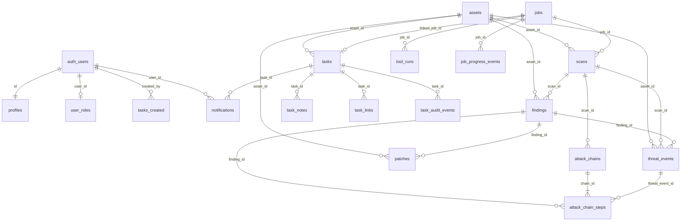
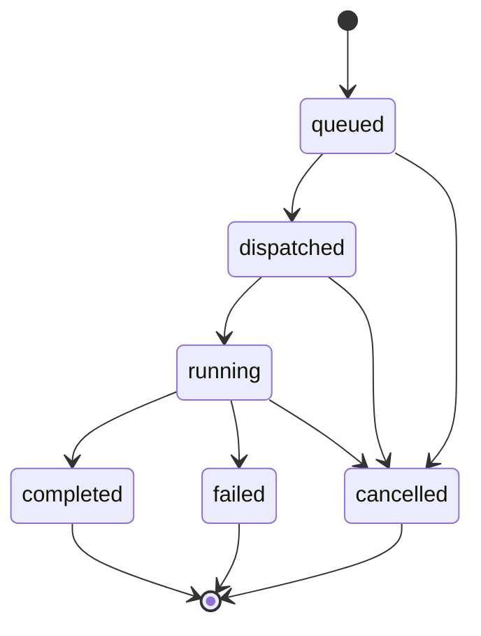
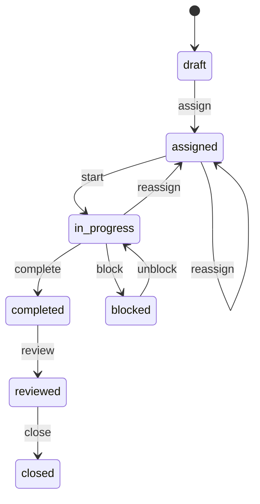

# Data model

Postgres schema lives in `secure_dash/supabase/migrations/` and is applied in timestamp order. This document is the **unified** model (features 001–004 plus later job-progress fields). Feature-local notes remain under `specs/*/data-model.md`.

**Store:** only `api_service` uses `SUPABASE_SECRET_KEY` / `DATABASE_URL`. Browser clients are SELECT-only on operational tables.

CAI chat sessions are **not** persisted (ephemeral on the blue worker). See [CAI runtime](#cai-chat-ephemeral).

## Entity-relationship diagram



Logical view:

```text
auth.users ── profiles
           └── user_roles (one app_role)

User ──requested_by──► Job ──┬──► Scan ──► Finding ──► Patch
                             │         └──► ThreatEvent
                             └──► ToolRun
                             └──► JobProgressEvent

Scan ──► AttackChain ──► AttackChainStep ──► (Finding | ThreatEvent)
Asset ◄── Scan | Finding | ThreatEvent | Patch | Task

Task ── notes / links / audit / notifications
     └── linked_job_id → Job
```

## Migration order

| File | Adds |
|------|------|
| `20260729100800_*.sql` | Base enums/tables: assets, scans, findings, threat_events, chains, user_roles + seed |
| `20260804120000_red_blue_platform.sql` | `team_side`, jobs, patches, tool_runs, team columns, revoke browser writes |
| `20260805140000_rbac_user_journeys.sql` | profiles, tasks, notes, links, audit, notifications, role rename |
| `20260903120000_task_discovery_chain_fields.sql` | `attack_chain_steps.category`, `source_tool`, `evidence` |
| `20260903180000_job_progress_and_stop.sql` | `job_progress_events`, audit action `stopped` |

## Enums

| Enum | Values |
|------|--------|
| `severity_level` | `critical`, `high`, `medium`, `low`, `info` |
| `finding_status` | `open`, `investigating`, `remediated`, `accepted_risk`, `false_positive` |
| `threat_status` | `new`, `investigating`, `resolved`, `blocked`, `blocked_by_guardrail` |
| `scan_status` | `queued`, `running`, `completed`, `failed` |
| `chain_stage` | `recon`, `initial_access`, `execution`, `persistence`, `exfiltration` |
| `app_role` | `user`, `security_analyst`, `security_manager`, `admin` (legacy `analyst` renamed) |
| `team_side` | `red`, `blue` |
| `job_status` | `queued`, `dispatched`, `running`, `completed`, `failed`, `cancelled` |
| `patch_status` | `proposed`, `approved`, `applied`, `failed`, `rolled_back` |
| `user_account_status` | `pending`, `active`, `disabled` |
| `task_type` | `red`, `blue` |
| `task_status` | `draft`, `assigned`, `in_progress`, `blocked`, `completed`, `reviewed`, `closed` |
| `task_audit_action` | `created`, `assigned`, `started`, `started_on_behalf`, `blocked`, `unblocked`, `completed`, `reviewed`, `closed`, `reassigned`, `note_added`, `link_added`, `stopped` |
| `task_link_kind` | `finding`, `scan` |
| `notification_type` | `task_assigned`, `task_reassigned`, `task_completed_for_review`, `generic` |

## Core security objects

### Asset

| Column | Type | Notes |
|--------|------|--------|
| `id` | uuid PK | |
| `name` | text NOT NULL | |
| `hostname`, `ip_address` | text NOT NULL | Network identity |
| `kind` | text | default `host` |
| `criticality` | `severity_level` | default `medium` |
| `created_at` | timestamptz | |

Job targets are `jobs.asset_ids uuid[]` (must be non-empty).

### Scan

| Column | Type | Notes |
|--------|------|--------|
| `id` | uuid PK | |
| `target` | text | Display / target string |
| `asset_id` | FK → assets | ON DELETE SET NULL |
| `profile` | text | e.g. `surface-recon`, `deep-emulation`, `defensive-validation` |
| `status` | `scan_status` | |
| `started_at`, `finished_at` | timestamptz | |
| `findings_count` | int | |
| `created_by` | uuid | |
| `team` | `team_side` | NOT NULL, default `red` |
| `job_id` | FK → jobs | nullable for legacy rows |
| `source_service` | text | `red_team_backend` / `blue_team_backend` |

Realtime: published.

### Finding

| Column | Type | Notes |
|--------|------|--------|
| `id` | uuid PK | |
| `scan_id` | FK → scans | ON DELETE CASCADE |
| `asset_id` | FK → assets | |
| `cve`, `title`, `remediation` | text | title required |
| `severity` | `severity_level` | |
| `cvss` | numeric(3,1) | |
| `status` | `finding_status` | default `open` |
| `evidence` | jsonb | default `[]` |
| `detected_at`, `resolved_at` | timestamptz | |
| `team` | `team_side` | |
| `source_tool` | text | e.g. `nmap`, `nuclei`, `trivy`, `cai` |

```text
open → investigating → remediated | accepted_risk | false_positive
```

Successful patch apply **must** set status to `remediated`. Failed patch must not.

Realtime: published.

### Threat event

| Column | Type | Notes |
|--------|------|--------|
| `id` | uuid PK | |
| `scan_id`, `asset_id`, `finding_id` | FKs | optional |
| `technique` | text | MITRE ID (e.g. `T1595.002`) |
| `technique_name`, `description` | text | |
| `source_ip` | text | |
| `severity` | `severity_level` | |
| `status` | `threat_status` | |
| `source_tag` | text | `hexstrike`, `cai`, `cai-guardrail`, … |
| `raw_payload` | jsonb | |
| `occurred_at` | timestamptz | |
| `team` | `team_side` | |

Guardrail blocks use `status=blocked_by_guardrail` (and/or matching `source_tag`). Realtime: published.

### Attack chain and steps

**Chain:** `id`, `name`, `scan_id`, `created_at`, `team`.

**Step:** `id`, `chain_id`, `stage` (`chain_stage`), `sequence`, `title`, `severity`, `threat_event_id`, `finding_id`, plus task-discovery fields:

| Column | Notes |
|--------|--------|
| `category` | Findings / tools grouping |
| `source_tool` | Tool that produced the step |
| `evidence` | Text evidence snippet |

`sequence` is ordered within a chain.

## Jobs, tools, patches

### Job

| Column | Type | Notes |
|--------|------|--------|
| `id` | uuid PK | |
| `team` | `team_side` NOT NULL | |
| `profile` | text NOT NULL | Pipeline name |
| `status` | `job_status` | default `queued` |
| `asset_ids` | uuid[] | CHECK cardinality ≥ 1 |
| `requested_by` | uuid | Auth user |
| `dispatcher_payload` | jsonb | default `{}` |
| `error` | text | Fail-closed message |
| `started_at`, `finished_at`, `created_at` | timestamptz | |



Terminal statuses: `completed`, `failed`, `cancelled`. Further progress writes → **409 Conflict**.

Realtime: published.

### Tool run

Audit of one tool invocation: `job_id`, `team`, `tool_name`, `command_summary`, `exit_code`, `raw_output`, timestamps.

Live provenance:

| Field | HexStrike | CAI plan |
|-------|-----------|----------|
| `findings.source_tool` | `nmap`, `nuclei`, … | `cai` |
| `threat_events.source_tag` | `hexstrike` | `cai` |
| `tool_runs.tool_name` | HexStrike tool id | `cai-plan` |
| `scans.source_service` | `red_team_backend` / `blue_team_backend` | same |

### Job progress event

Streaming UI for a live task run.

| Column | Notes |
|--------|--------|
| `job_id` | FK → jobs ON DELETE CASCADE |
| `kind` | `thinking` \| `tool` \| `process` \| `status` |
| `message` | Human-readable line |
| `meta` | jsonb |
| `created_at` | |

Indexed on `(job_id, created_at)`.

### Patch

| Column | Type | Notes |
|--------|------|--------|
| `id` | uuid PK | |
| `finding_id` | FK findings CASCADE | |
| `asset_id` | FK assets SET NULL | |
| `title`, `playbook` | text NOT NULL | e.g. `upgrade-package` |
| `status` | `patch_status` | default `proposed` |
| `evidence` | jsonb | |
| `created_by`, `applied_at`, `created_at` | | |

```text
proposed → approved → applied
                   ↘ failed
applied → rolled_back
```

`applied` → linked finding `remediated`. Realtime: published.

## Identity and tasks

### Profile

PK `id` = `auth.users.id`. Fields: `email`, `display_name`, `status` (`pending`/`active`/`disabled`), `must_change_password`, invite timestamps, `last_login_at`.

Unused invite expires when `now() > invite_expires_at`. Password change consumes the invite and sets `status=active`.

### User role

One `app_role` per user (unique on `user_id`). `has_role(uuid, app_role)` is a `SECURITY DEFINER` SQL helper.

### Task

| Column | Notes |
|--------|--------|
| `target`, `description`, `patch_scope` | Manager-writable |
| `asset_id` | optional FK assets |
| `task_type` | red / blue |
| `status` | default `draft` |
| `created_by`, `assignee_id`, `assigning_manager_id` | auth users |
| `linked_job_id` | optional FK jobs |
| `started_at`, `completed_at`, `closed_at` | |



| Action | Analyst (assignee) | Manager |
|--------|--------------------|---------|
| assign / edit metadata | No | Yes |
| start | Own assigned | Any (`started_on_behalf` if not self) |
| block / unblock | Own | Yes |
| complete | Own | Any |
| reviewed / closed | **No** | Yes |
| reassign | No | Yes → `assigned` |
| stop | Own in-progress | Yes (`stopped` audit) |

Child tables: `task_notes` (body), `task_links` (`kind` + `ref_id` of finding or scan), `task_audit_events` (from/to status and assignee).

### Notification

`user_id`, `type`, optional `task_id`, `title`, `body`, `read_at`.

### Tool unlock (application, not RLS)

```text
can_open_red(analyst)  ⇔ ∃ task: assignee=analyst ∧ status=in_progress ∧ task_type=red
can_open_blue(analyst) ⇔ ∃ task: assignee=analyst ∧ status=in_progress ∧ task_type=blue
can_open_*(manager)    ⇔ true
can_open_*(admin)      ⇔ false
```

## CAI chat (ephemeral)

Not in Postgres. Worker-local session:

| Field | Notes |
|-------|--------|
| `id`, `team`, `user_id` | Owner |
| `status` | `starting` → `running` → `stopping`/`stopped`/`failed` |
| `task_id` | Optional UI context |
| Stream events | `started`, `stdout`, `stderr`, `user_echo`, `status`, `error`, `ended` |

One active session per `(user_id, team)` in v1. Buffer last N events for SSE reconnect.

## RBAC

Intended product matrix (API + UI). Writes go through `api_service` (service role); RLS is defense-in-depth SELECT.

| Role | Tasks | Ops tables (scans/findings/threats) | Admin Panel | Red/Blue tools |
|------|-------|--------------------------------------|-------------|----------------|
| `user` | none | read-only | no | no |
| `security_analyst` | own assigned | scoped SELECT + job start when unlocked | no | if matching `in_progress` task |
| `security_manager` | all task CRUD | SELECT all | no | always |
| `admin` | deny ops tools | typically no tools | yes (invite / roles) | **no** |

First admin: `scripts/bootstrap_admin.py` from `TEST_USERNAME` / `TEST_PASSWORD`. No in-app wizard.

## Validation rules

- `jobs.asset_ids` non-empty (DB check + API 422)
- Terminal job → further worker progress → 409
- Patch `applied` → finding `remediated`
- Service token cannot `DELETE` assets or mutate roles
- Unauthenticated API → 401
