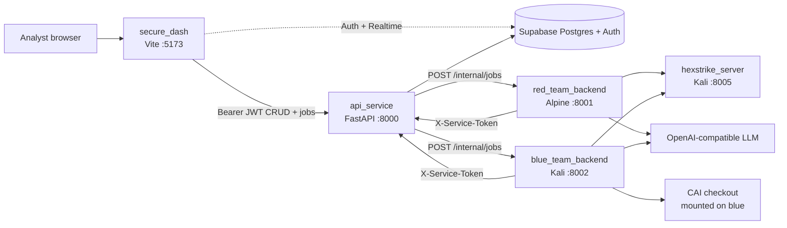
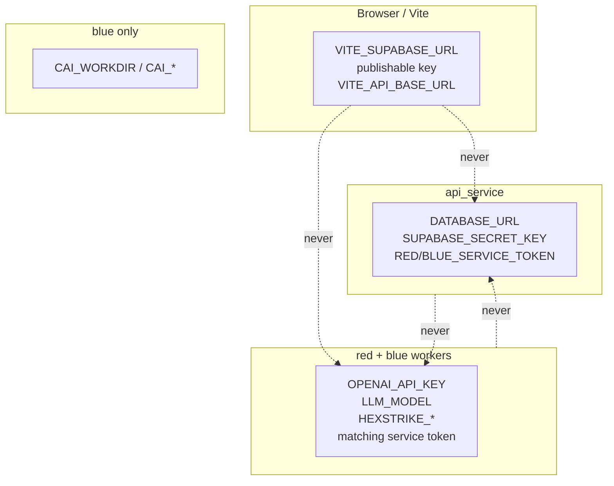
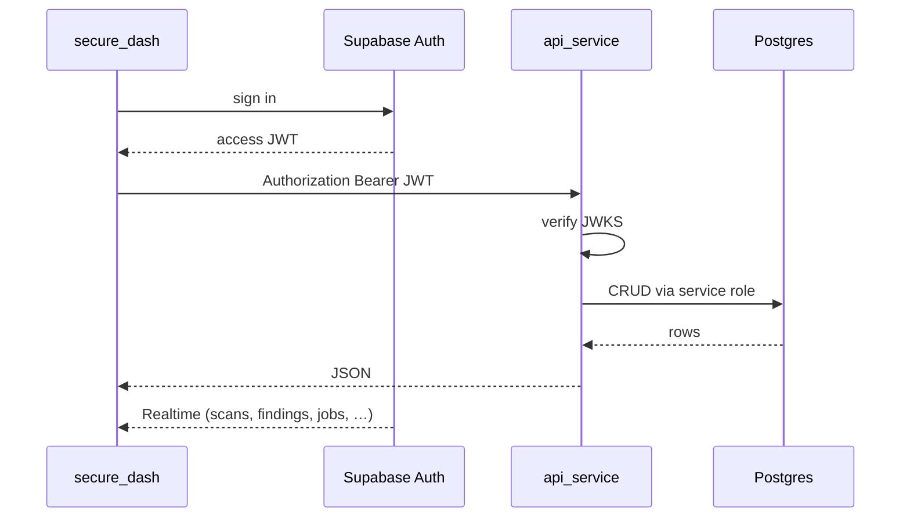
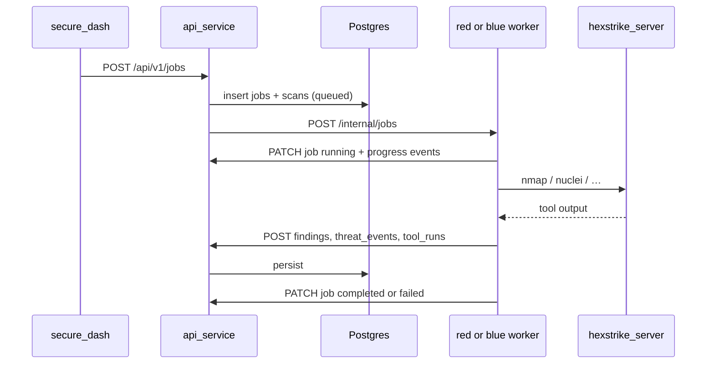
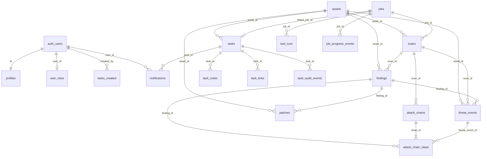
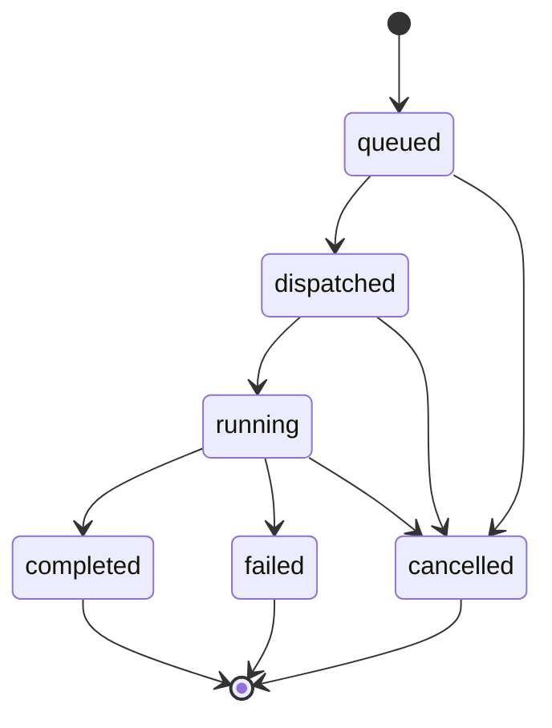
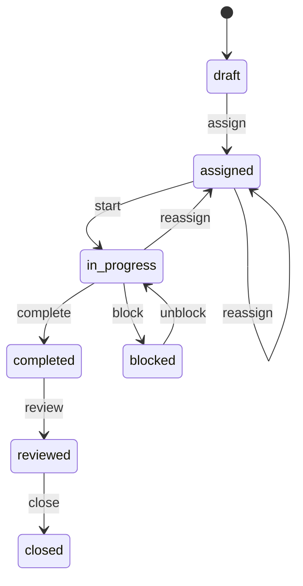
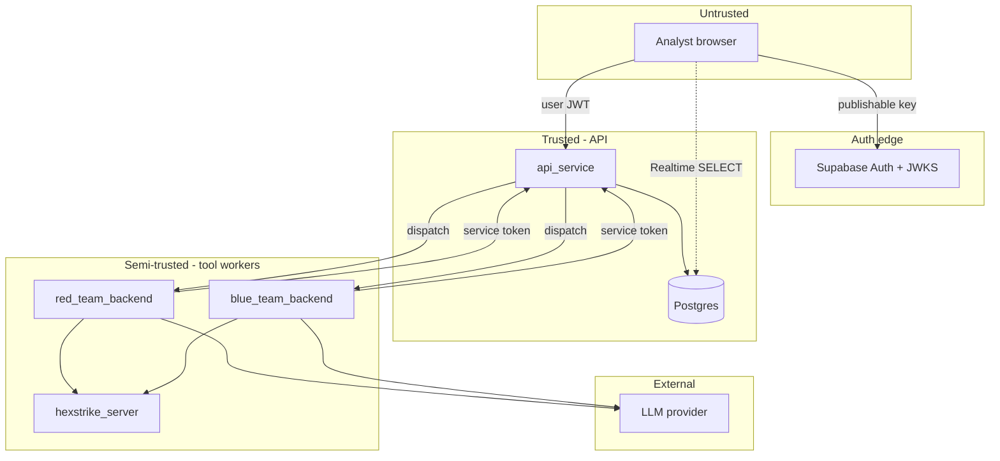

# AI Dhal — master documentation

Lab platform for **red-team** (offensive recon / emulation) and **blue-team** (vuln scan / patch) work: analyst UI, a single database-owning API, HexStrike tool runners, and optional CAI on blue.

Install and run: root [`README.md`](../README.md). Feature specs: [`specs/`](../specs/). Split pages: [architecture](architecture.md), [data model](data-model.md), [API](api-contracts.md), [threat model](threat-model.md).

---

## Contents

1. [Overview](#1-overview)
2. [Architecture](#2-architecture)
3. [Request flows](#3-request-flows)
4. [Pipelines, AuthZ, UI, API](#4-pipelines-authz-ui-api)
5. [Data model](#5-data-model)
6. [Identity, tasks, RBAC](#6-identity-tasks-rbac)
7. [API contracts](#7-api-contracts)
8. [Threat model](#8-threat-model)
9. [Related files](#9-related-files)

---

## 1. Overview

**`api_service` is the only process that talks to Postgres.** The UI authenticates with Supabase and sends JWTs to the API. Red and blue workers run tools (HexStrike, optional CAI) and report results back through the API with service tokens.

```text
secure_dash ──JWT──► api_service ──► Postgres/Supabase (API only)
                         │
            ┌────────────┴────────────┐
            ▼                         ▼
     red_team_backend          blue_team_backend
     (LLM + HexStrike)         (LLM + HexStrike + CAI)
            │                         │
            └──── service token ──────┘
                         ▼
                   api_service (report findings/events)

hexstrike_server (nmap, nuclei, …) ◄── red/blue workers
```

### Repository layout

```text
ai_dhal/
├── docker-compose.yml          # API, red, blue, hexstrike
├── api_service/                # FastAPI CRUD + job orchestration (:8000)
├── red_team_backend/           # Alpine worker (:8001)
├── blue_team_backend/          # Kali worker + CAI (:8002)
├── hexstrike_server/           # HexStrike MCP/API (:8005)
├── secure_dash/                # Analyst UI (:5173)
│   └── supabase/migrations/    # Postgres schema (source of truth)
├── docs/                       # This documentation
├── specs/                      # Feature specs (001–004)
└── scripts/                    # migrations, bootstrap, smoke checks
```

UI is **not** in Compose. Run it on the host (`cd secure_dash && npm run dev`).

---

## 2. Architecture

### 2.1 System context



### 2.2 Service map

| Service | Image / runtime | Host port | May touch DB? | Responsibility |
|---------|-----------------|-----------|---------------|----------------|
| `secure_dash` | Node 20+, TanStack Start / Vite | **5173** | No (Auth + Realtime only) | Analyst UI. All business CRUD via API. |
| `api_service` | `python:3.12-slim` | **8000** | **Yes — only writer** | JWT/JWKS + service-token AuthZ, CRUD, job dispatch |
| `red_team_backend` | `python:3.12-alpine` | **8001** | No | Surface recon, task discovery, HexStrike MCP/HTTP |
| `blue_team_backend` | `kalilinux/kali-rolling` | **8002** | No | Vuln scan, monitor, patches, live CAI chat |
| `hexstrike_server` | Kali + security tools | **8005** | No | nmap, nuclei, gobuster, and other tool HTTP/MCP |

### 2.3 Secret placement



| Secret | API | Red | Blue | UI |
|--------|:---:|:---:|:----:|:--:|
| `DATABASE_URL` / `SUPABASE_SECRET_KEY` | yes | no | no | **no** |
| Publishable Supabase key | no | no | no | yes |
| `RED_SERVICE_TOKEN` | yes | yes | no | no |
| `BLUE_SERVICE_TOKEN` | yes | no | yes | no |
| `OPENAI_API_KEY` / `LLM_MODEL` | **no** | yes | yes | no |
| `HEXSTRIKE_*` | no | yes | yes | no |
| `CAI_*` | no | disabled | yes | no |

### 2.4 Compose vs native URLs

| Setting | Docker Compose | Native (host processes) |
|---------|----------------|-------------------------|
| `RED_WORKER_URL` | `http://red_team_backend:8001` | `http://localhost:8001` |
| `BLUE_WORKER_URL` | `http://blue_team_backend:8002` | `http://localhost:8002` |
| `HEXSTRIKE_BASE_URL` | `http://hexstrike_server:8005` | `http://localhost:8005` |
| API from workers | `http://api_service:8000/api/v1` | `http://localhost:8000/api/v1` |
| UI → API | Vite proxy `/api` → `127.0.0.1:8000` | same |

### 2.5 Health checks

| Process | Check |
|---------|--------|
| API | `GET /api/v1/health`, `GET /api/v1/ready` |
| Red / blue / HexStrike | `GET /health` |

Workers wait until HexStrike is healthy (`depends_on` + health condition).

---

## 3. Request flows

### 3.1 Analyst CRUD



### 3.2 Start a red or blue job



### 3.3 Task-driven tool unlock

Managers create **tasks** (red or blue). An analyst with an `in_progress` task of that type may open `/tools/red` or `/tools/blue`. Managers always can. Admins cannot open tools.

Starting a tool run from a task may set `tasks.linked_job_id` → `jobs.id`. Live progress is written to `job_progress_events`.

### 3.4 Blue CAI chat

Interactive CAI (`uv run cai`) runs **inside the blue container**. The API proxies SSE; secrets stay on the worker. Red CAI is disabled (Alpine image).

```text
UI ──JWT──► API /cai-chat ──service token──► blue /tools/blue ──► uv run cai
```

---

## 4. Pipelines, AuthZ, UI, API

### 4.1 Pipelines

| Team | Profile / pipeline | Typical tools | Writes |
|------|--------------------|---------------|--------|
| Red | `surface-recon` | HexStrike nmap (and related) | findings, threat_events, tool_runs |
| Red | `task-discovery` | HexStrike chain → attack_chain_steps | chains + steps (`category`, `source_tool`, `evidence`) |
| Red | `deep-emulation` | LLM plan (CAI disabled on red) | chain-shaped plan + events |
| Blue | `vuln_scan` | HexStrike nuclei / similar | findings (`team=blue`) |
| Blue | `monitor` | poll / alert adapters | threat_events |
| Blue | `patch` | playbook apply | patches + finding `remediated` |

Live HexStrike (`HEXSTRIKE_STUB=0`) **fails closed** if the server is down. Stub mode is for CI/offline only.

Safety: `DEMO_SAFE_MODE=1` + `TARGET_ALLOWLIST` — out-of-scope targets emit `blocked_by_guardrail` events and must not run exploit tools.

### 4.2 AuthN / AuthZ

| Principal | How | Allowed |
|-----------|-----|---------|
| Analyst / Manager / Admin / User | `Authorization: Bearer <Supabase JWT>` (JWKS) | Role-scoped CRUD; see [RBAC](#64-rbac) |
| Red worker | `X-Service-Token: RED_SERVICE_TOKEN` | Insert/update findings, events, chains, tool_runs, job/scan progress |
| Blue worker | `X-Service-Token: BLUE_SERVICE_TOKEN` | Same for blue team + patches |
| Browser PostgREST | publishable key | SELECT only on operational tables (writes revoked) |

Service tokens cannot delete assets or change `user_roles`. Admin bootstrap is out-of-band: `scripts/bootstrap_admin.py`.

### 4.3 UI routes (`secure_dash`)

| Route | Purpose |
|-------|---------|
| `/auth` | Sign in |
| `/` | Dashboard KPIs |
| `/scans` | Scan list / launch jobs |
| `/threats` | Threat events |
| `/attack-chain` | Kill-chain visualization |
| `/patches` | Blue remediation |
| `/tasks`, `/tasks/:taskId` | Task board and detail |
| `/tools/red`, `/tools/blue` | Live tools + CAI (role + task unlock) |
| `/admin` | Invite users / assign roles |

### 4.4 API routers (`api_service`)

Base path: `/api/v1`.

| Router | Domain |
|--------|--------|
| `assets`, `scans`, `findings`, `threat_events` | Core security objects |
| `jobs`, `patches` | Orchestration and remediation |
| `tasks` | RBAC task journeys |
| `cai_chat` | Proxy SSE to blue CAI |
| `admin_users`, `me`, `auth_login` | Identity and Admin Panel |
| `misc` | Health, readiness, remaining surfaces |

Canonical OpenAPI: [`specs/001-red-blue-platform/contracts/openapi.yaml`](../specs/001-red-blue-platform/contracts/openapi.yaml).

---

## 5. Data model

Postgres schema lives in `secure_dash/supabase/migrations/` and is applied in timestamp order. This is the unified model (features 001–004 plus job-progress fields).

**Store:** only `api_service` uses `SUPABASE_SECRET_KEY` / `DATABASE_URL`. Browser clients are SELECT-only on operational tables.

CAI chat sessions are **not** persisted (ephemeral on the blue worker). See [CAI chat](#63-cai-chat-ephemeral).

### 5.1 Entity-relationship diagram



```text
auth.users ── profiles
           └── user_roles (one app_role)

User ──requested_by──► Job ──┬──► Scan ──► Finding ──► Patch
                             │         └──► ThreatEvent
                             └──► ToolRun
                             └──► JobProgressEvent

Scan ──► AttackChain ──► AttackChainStep ──► (Finding | ThreatEvent)
Asset ◄── Scan | Finding | ThreatEvent | Patch | Task

Task ── notes / links / audit / notifications
     └── linked_job_id → Job
```

### 5.2 Migration order

| File | Adds |
|------|------|
| `20260729100800_*.sql` | Base enums/tables: assets, scans, findings, threat_events, chains, user_roles + seed |
| `20260804120000_red_blue_platform.sql` | `team_side`, jobs, patches, tool_runs, team columns, revoke browser writes |
| `20260805140000_rbac_user_journeys.sql` | profiles, tasks, notes, links, audit, notifications, role rename |
| `20260903120000_task_discovery_chain_fields.sql` | `attack_chain_steps.category`, `source_tool`, `evidence` |
| `20260903180000_job_progress_and_stop.sql` | `job_progress_events`, audit action `stopped` |

### 5.3 Enums

| Enum | Values |
|------|--------|
| `severity_level` | `critical`, `high`, `medium`, `low`, `info` |
| `finding_status` | `open`, `investigating`, `remediated`, `accepted_risk`, `false_positive` |
| `threat_status` | `new`, `investigating`, `resolved`, `blocked`, `blocked_by_guardrail` |
| `scan_status` | `queued`, `running`, `completed`, `failed` |
| `chain_stage` | `recon`, `initial_access`, `execution`, `persistence`, `exfiltration` |
| `app_role` | `user`, `security_analyst`, `security_manager`, `admin` (legacy `analyst` renamed) |
| `team_side` | `red`, `blue` |
| `job_status` | `queued`, `dispatched`, `running`, `completed`, `failed`, `cancelled` |
| `patch_status` | `proposed`, `approved`, `applied`, `failed`, `rolled_back` |
| `user_account_status` | `pending`, `active`, `disabled` |
| `task_type` | `red`, `blue` |
| `task_status` | `draft`, `assigned`, `in_progress`, `blocked`, `completed`, `reviewed`, `closed` |
| `task_audit_action` | `created`, `assigned`, `started`, `started_on_behalf`, `blocked`, `unblocked`, `completed`, `reviewed`, `closed`, `reassigned`, `note_added`, `link_added`, `stopped` |
| `task_link_kind` | `finding`, `scan` |
| `notification_type` | `task_assigned`, `task_reassigned`, `task_completed_for_review`, `generic` |

### 5.4 Core security objects

#### Asset

| Column | Type | Notes |
|--------|------|--------|
| `id` | uuid PK | |
| `name` | text NOT NULL | |
| `hostname`, `ip_address` | text NOT NULL | Network identity |
| `kind` | text | default `host` |
| `criticality` | `severity_level` | default `medium` |
| `created_at` | timestamptz | |

Job targets are `jobs.asset_ids uuid[]` (must be non-empty).

#### Scan

| Column | Type | Notes |
|--------|------|--------|
| `id` | uuid PK | |
| `target` | text | Display / target string |
| `asset_id` | FK → assets | ON DELETE SET NULL |
| `profile` | text | e.g. `surface-recon`, `deep-emulation`, `defensive-validation` |
| `status` | `scan_status` | |
| `started_at`, `finished_at` | timestamptz | |
| `findings_count` | int | |
| `created_by` | uuid | |
| `team` | `team_side` | NOT NULL, default `red` |
| `job_id` | FK → jobs | nullable for legacy rows |
| `source_service` | text | `red_team_backend` / `blue_team_backend` |

Realtime: published.

#### Finding

| Column | Type | Notes |
|--------|------|--------|
| `id` | uuid PK | |
| `scan_id` | FK → scans | ON DELETE CASCADE |
| `asset_id` | FK → assets | |
| `cve`, `title`, `remediation` | text | title required |
| `severity` | `severity_level` | |
| `cvss` | numeric(3,1) | |
| `status` | `finding_status` | default `open` |
| `evidence` | jsonb | default `[]` |
| `detected_at`, `resolved_at` | timestamptz | |
| `team` | `team_side` | |
| `source_tool` | text | e.g. `nmap`, `nuclei`, `trivy`, `cai` |

```text
open → investigating → remediated | accepted_risk | false_positive
```

Successful patch apply **must** set status to `remediated`. Failed patch must not. Realtime: published.

#### Threat event

| Column | Type | Notes |
|--------|------|--------|
| `id` | uuid PK | |
| `scan_id`, `asset_id`, `finding_id` | FKs | optional |
| `technique` | text | MITRE ID (e.g. `T1595.002`) |
| `technique_name`, `description` | text | |
| `source_ip` | text | |
| `severity` | `severity_level` | |
| `status` | `threat_status` | |
| `source_tag` | text | `hexstrike`, `cai`, `cai-guardrail`, … |
| `raw_payload` | jsonb | |
| `occurred_at` | timestamptz | |
| `team` | `team_side` | |

Guardrail blocks use `status=blocked_by_guardrail` (and/or matching `source_tag`). Realtime: published.

#### Attack chain and steps

**Chain:** `id`, `name`, `scan_id`, `created_at`, `team`.

**Step:** `id`, `chain_id`, `stage` (`chain_stage`), `sequence`, `title`, `severity`, `threat_event_id`, `finding_id`, plus:

| Column | Notes |
|--------|--------|
| `category` | Findings / tools grouping |
| `source_tool` | Tool that produced the step |
| `evidence` | Text evidence snippet |

`sequence` is ordered within a chain.

### 5.5 Jobs, tools, patches

#### Job

| Column | Type | Notes |
|--------|------|--------|
| `id` | uuid PK | |
| `team` | `team_side` NOT NULL | |
| `profile` | text NOT NULL | Pipeline name |
| `status` | `job_status` | default `queued` |
| `asset_ids` | uuid[] | CHECK cardinality ≥ 1 |
| `requested_by` | uuid | Auth user |
| `dispatcher_payload` | jsonb | default `{}` |
| `error` | text | Fail-closed message |
| `started_at`, `finished_at`, `created_at` | timestamptz | |



Terminal statuses: `completed`, `failed`, `cancelled`. Further progress writes → **409 Conflict**. Realtime: published.

#### Tool run

Audit of one tool invocation: `job_id`, `team`, `tool_name`, `command_summary`, `exit_code`, `raw_output`, timestamps.

| Field | HexStrike | CAI plan |
|-------|-----------|----------|
| `findings.source_tool` | `nmap`, `nuclei`, … | `cai` |
| `threat_events.source_tag` | `hexstrike` | `cai` |
| `tool_runs.tool_name` | HexStrike tool id | `cai-plan` |
| `scans.source_service` | `red_team_backend` / `blue_team_backend` | same |

#### Job progress event

| Column | Notes |
|--------|--------|
| `job_id` | FK → jobs ON DELETE CASCADE |
| `kind` | `thinking` \| `tool` \| `process` \| `status` |
| `message` | Human-readable line |
| `meta` | jsonb |
| `created_at` | |

Indexed on `(job_id, created_at)`.

#### Patch

| Column | Type | Notes |
|--------|------|--------|
| `id` | uuid PK | |
| `finding_id` | FK findings CASCADE | |
| `asset_id` | FK assets SET NULL | |
| `title`, `playbook` | text NOT NULL | e.g. `upgrade-package` |
| `status` | `patch_status` | default `proposed` |
| `evidence` | jsonb | |
| `created_by`, `applied_at`, `created_at` | | |

```text
proposed → approved → applied
                   ↘ failed
applied → rolled_back
```

`applied` → linked finding `remediated`. Realtime: published.

### 5.6 Validation rules

- `jobs.asset_ids` non-empty (DB check + API 422)
- Terminal job → further worker progress → 409
- Patch `applied` → finding `remediated`
- Service token cannot `DELETE` assets or mutate roles
- Unauthenticated API → 401

---

## 6. Identity, tasks, RBAC

### 6.1 Profile and role

**Profile:** PK `id` = `auth.users.id`. Fields: `email`, `display_name`, `status` (`pending`/`active`/`disabled`), `must_change_password`, invite timestamps, `last_login_at`.

Unused invite expires when `now() > invite_expires_at`. Password change consumes the invite and sets `status=active`.

**User role:** one `app_role` per user (unique on `user_id`). `has_role(uuid, app_role)` is a `SECURITY DEFINER` SQL helper.

### 6.2 Task

| Column | Notes |
|--------|--------|
| `target`, `description`, `patch_scope` | Manager-writable |
| `asset_id` | optional FK assets |
| `task_type` | red / blue |
| `status` | default `draft` |
| `created_by`, `assignee_id`, `assigning_manager_id` | auth users |
| `linked_job_id` | optional FK jobs |
| `started_at`, `completed_at`, `closed_at` | |



| Action | Analyst (assignee) | Manager |
|--------|--------------------|---------|
| assign / edit metadata | No | Yes |
| start | Own assigned | Any (`started_on_behalf` if not self) |
| block / unblock | Own | Yes |
| complete | Own | Any |
| reviewed / closed | **No** | Yes |
| reassign | No | Yes → `assigned` |
| stop | Own in-progress | Yes (`stopped` audit) |

Child tables: `task_notes` (body), `task_links` (`kind` + `ref_id` of finding or scan), `task_audit_events` (from/to status and assignee).

**Notification:** `user_id`, `type`, optional `task_id`, `title`, `body`, `read_at`.

#### Tool unlock (application, not RLS)

```text
can_open_red(analyst)  ⇔ ∃ task: assignee=analyst ∧ status=in_progress ∧ task_type=red
can_open_blue(analyst) ⇔ ∃ task: assignee=analyst ∧ status=in_progress ∧ task_type=blue
can_open_*(manager)    ⇔ true
can_open_*(admin)      ⇔ false
```

### 6.3 CAI chat (ephemeral)

Not in Postgres. Worker-local session:

| Field | Notes |
|-------|--------|
| `id`, `team`, `user_id` | Owner |
| `status` | `starting` → `running` → `stopping`/`stopped`/`failed` |
| `task_id` | Optional UI context |
| Stream events | `started`, `stdout`, `stderr`, `user_echo`, `status`, `error`, `ended` |

One active session per `(user_id, team)` in v1. Buffer last N events for SSE reconnect.

### 6.4 RBAC

Writes go through `api_service` (service role); RLS is defense-in-depth SELECT.

| Role | Tasks | Ops tables (scans/findings/threats) | Admin Panel | Red/Blue tools |
|------|-------|--------------------------------------|-------------|----------------|
| `user` | none | read-only | no | no |
| `security_analyst` | own assigned | scoped SELECT + job start when unlocked | no | if matching `in_progress` task |
| `security_manager` | all task CRUD | SELECT all | no | always |
| `admin` | deny ops tools | typically no tools | yes (invite / roles) | **no** |

First admin: `scripts/bootstrap_admin.py` from `TEST_USERNAME` / `TEST_PASSWORD`. No in-app wizard.

---

## 7. API contracts

| Surface | Base | Auth |
|---------|------|------|
| Platform API | `http://localhost:8000/api/v1` | Bearer user JWT (**JWKS** verify) or `X-Service-Token` (workers) |
| Red worker | `http://localhost:8001` | Internal `POST /internal/jobs` |
| Blue worker | `http://localhost:8002` | Internal `POST /internal/jobs` |
| HexStrike | `http://localhost:8005` | Tool HTTP / MCP (workers) |
| `secure_dash` | `http://localhost:5173` | Supabase Auth + Realtime (publishable key); business CRUD via platform API |

**Keys**

- Browser: publishable (`sb_publishable_…`) only
- API data: secret (`sb_secret_…`) or legacy service_role — never in `VITE_*`
- User JWT: verify via `{SUPABASE_URL}/auth/v1/.well-known/jwks.json` (legacy JWT secret deprecated)

**Contract files**

- OpenAPI: [`specs/001-red-blue-platform/contracts/openapi.yaml`](../specs/001-red-blue-platform/contracts/openapi.yaml)
- Internal jobs: [`specs/001-red-blue-platform/contracts/internal-jobs.md`](../specs/001-red-blue-platform/contracts/internal-jobs.md)
- Env / JWKS: [`specs/003-supabase-primary-db/contracts/env.md`](../specs/003-supabase-primary-db/contracts/env.md)
- Supabase access: [`specs/003-supabase-primary-db/contracts/supabase-access.md`](../specs/003-supabase-primary-db/contracts/supabase-access.md)

---

## 8. Threat model

Lab-scope notes, not a production STRIDE assessment.

### 8.1 Trust boundaries



1. **Browser** — Supabase Auth session only. No DB write keys. Business mutations go through the platform API with the user JWT.
2. **api_service** — Sole holder of `DATABASE_URL` / Supabase secret key. Enforces JWT and service-token AuthZ.
3. **red_team_backend / blue_team_backend** — Hold `OPENAI_API_KEY` + service tokens. **Must not** receive DB credentials. Report findings/events via API.
4. **hexstrike_server** — Tool execution. Reachable from workers on the Compose network; not given Supabase or LLM keys.

### 8.2 Assets at risk

- LLM API keys on workers
- Service tokens that can insert findings / patch jobs
- User JWTs (forged session if JWKS/signing keys are wrong)
- HexStrike as a powerful scanner if `TARGET_ALLOWLIST` is empty and safe mode is off

### 8.3 Mitigations (lab)

- `DEMO_SAFE_MODE` + `TARGET_ALLOWLIST` on workers
- Service tokens denied for asset delete and role assignment
- `LLM_STUB=1` / `HEXSTRIKE_STUB=1` / `CAI_CHAT_STUB=1` for offline/CI
- Browser RLS: SELECT-only on operational tables after migration
- JWKS verification of user JWTs (legacy HS256 secret deprecated)
- Live HexStrike **fails closed** (no silent stub fallback)
- Admin bootstrap out-of-band; Admin role cannot open red/blue tools

### 8.4 Out of scope

Full STRIDE treatment, production key rotation, and network segmentation beyond Compose service isolation.

---

## 9. Related files

| Path | Role |
|------|------|
| [`README.md`](../README.md) | Install, env, Compose, tests |
| [`plan.md`](../plan.md) | Original architecture plan |
| [`docs/architecture.md`](architecture.md) | Architecture only |
| [`docs/data-model.md`](data-model.md) | Data model only |
| [`docs/api-contracts.md`](api-contracts.md) | API pointers |
| [`docs/threat-model.md`](threat-model.md) | Threat model only |
| [`specs/001-red-blue-platform/`](../specs/001-red-blue-platform/) | Platform + jobs |
| [`specs/002-rbac-user-journeys/`](../specs/002-rbac-user-journeys/) | Roles and Admin bootstrap |
| [`specs/003-supabase-primary-db/`](../specs/003-supabase-primary-db/) | Store, JWKS, env |
| [`specs/004-cai-tools-chat/`](../specs/004-cai-tools-chat/) | Kali CAI chat |
