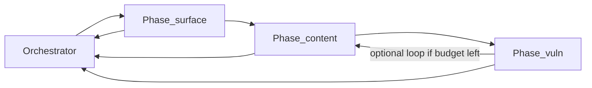

# Architecture

## Problem fit

Token overflow happens in live `task_discovery` when one LangChain agent binds many HexStrike tools and replays full raw tool stdout every step. This architecture **isolates context per tool**, **persists raw outside the chat**, and **forwards only capped summaries** between phases.

## Layered model

```text
┌─────────────────────────────────────────────────────────────┐
│ Orchestrator (deterministic + optional planner LLM)         │
│  - phase order, loop/retry budget, stop rules               │
│  - reads/writes job.context.json only (never raw)           │
└───────────────────────────┬─────────────────────────────────┘
                            │ phase brief + job.context
┌───────────────────────────▼─────────────────────────────────┐
│ Phase agent (surface | content | vuln | …)                  │
│  - chooses tool order / skip / retry within phase           │
│  - sees prior rollups + this phase tool summaries           │
└───────────────────────────┬─────────────────────────────────┘
                            │ one tool brief
┌───────────────────────────▼─────────────────────────────────┐
│ Tool agent (exactly one MCP tool, fresh chat every time)    │
│  - binds 1 tool schema                                      │
│  - returns raw → ArtifactStore                              │
└───────────────────────────┬─────────────────────────────────┘
                            │
              ┌─────────────▼─────────────┐
              │ JobArtifactStore (disk)   │
              │ raw / summary / rollup    │
              └─────────────┬─────────────┘
                            │
              ┌─────────────▼─────────────┐
              │ Compress                  │
              │ 1. heuristic consolidate  │
              │ 2. LLMLingua-2            │
              │ 3. hard token caps        │
              └───────────────────────────┘
```

## Default recon graph



| Phase | Goal | Default tools |
|-------|------|----------------|
| `surface` | Reachability + ports + HTTP fingerprint | `server_health`, `nmap_scan`, `httpx_toolkit` (`execute_command`) |
| `content` | Paths, crawl, API surfaces | `gobuster_scan` or `feroxbuster_scan`, `katana_crawl`, `rest_api_probe` |
| `vuln` | Exposure / misconfig tags | `nuclei_scan` |

## Scaling with more phases and loops

- **Add a phase** → new folder under `agents/prompts/phases/<name>/` + entry in phase registry; orchestrator list grows; token budget unchanged.
- **Loop** → orchestrator may re-enter a phase with updated `job.context`; each tool agent still starts with empty history.
- **Hard stops** → `max_phase_loops`, `max_tools_per_phase`, `max_job_wall_seconds` (see [guardrails.md](guardrails.md)).

## Where it sits in the product

```text
secure_dash → api_service → red_team_backend
                              pipelines/task_discovery.run()
                                → orchestration/orchestrator
                                → agents/prompts/* (system/user text)
                                → HexStrike MCP
                                → ApiReporter (unchanged UI contract)
```

## Non-goals (this build)

- Rewriting `surface_recon` / `deep_emulation`
- Re-enabling CAI
- Changing HexStrike MCP server code
