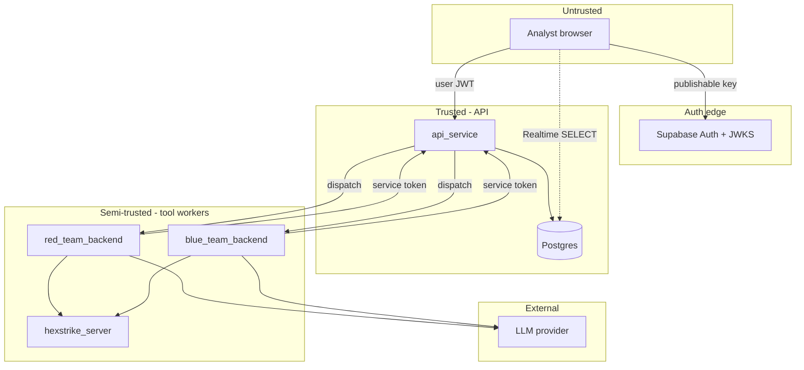

# Threat model (lab)

Lab-scope notes, not a production STRIDE assessment. Architecture detail: [architecture.md](architecture.md).

## Trust boundaries

1. **Browser** — Supabase Auth session only. No DB write keys. Business mutations go through the platform API with the user JWT.
2. **api_service** — Sole holder of `DATABASE_URL` / Supabase secret key. Enforces JWT and service-token AuthZ.
3. **red_team_backend / blue_team_backend** — Hold `OPENAI_API_KEY` + service tokens. **Must not** receive DB credentials. Report findings/events via API.
4. **hexstrike_server** — Tool execution. Reachable from workers on the Compose network; not given Supabase or LLM keys.

## Assets at risk

- LLM API keys on workers
- Service tokens that can insert findings / patch jobs
- User JWTs (forged session if JWKS/signing keys are wrong)
- HexStrike as a powerful scanner if `TARGET_ALLOWLIST` is empty and safe mode is off

## Mitigations (lab)

- `DEMO_SAFE_MODE` + `TARGET_ALLOWLIST` on workers
- Service tokens denied for asset delete and role assignment
- `LLM_STUB=1` / `HEXSTRIKE_STUB=1` / `CAI_CHAT_STUB=1` for offline/CI
- Browser RLS: SELECT-only on operational tables after migration
- JWKS verification of user JWTs (legacy HS256 secret deprecated)
- Live HexStrike **fails closed** (no silent stub fallback)
- Admin bootstrap out-of-band; Admin role cannot open red/blue tools

## Out of scope

Full STRIDE treatment, production key rotation, and network segmentation beyond Compose service isolation.
