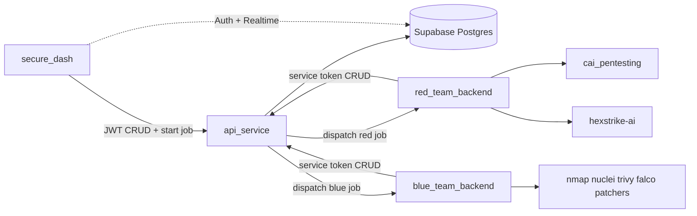

# Red/Blue Security Platform Architecture

Monorepo architecture where `api_service` owns all database CRUD, `secure_dash` talks only to that API, and `red_team_backend` / `blue_team_backend` run offensive and defensive tool pipelines—persisting results exclusively through the API.

## Implementation todos

- [ ] **S0 — Foundations:** Scaffold api_service, red_team_backend, blue_team_backend + docker-compose + schema migration
- [ ] **S1 — API CRUD:** Implement JWT/service-token CRUD routers; tighten RLS; point secure_dash reads/writes at API
- [ ] **S2 — Red MVP:** Jobs dispatch + red surface-recon pipeline via HexStrike adapter + API reporter
- [ ] **S3 — Blue MVP:** Blue vuln_scan + patches API/UI flow
- [ ] **S4 — CAI + monitors:** Wire CAI deep profiles, blue monitor, attack_chain builder
- [ ] **S5 — Hardening:** Automated test suite covering listed cases + allowlists/CI

---

## Service roles (hard boundaries)

| Service | May touch DB? | Responsibility |
|---------|---------------|----------------|
| **`api_service`** | **Yes — only writer/reader** | Authenticated REST CRUD over existing + extended tables; job orchestration (dispatch to red/blue); service-token auth for backends |
| **`secure_dash`** | No (Auth + Realtime subscribe only) | Analyst UI; all data mutate/read via `api_service`; trigger red/blue jobs through API |
| **`red_team_backend`** | No | Recon + intrusion via CAI and HexStrike MCP/HTTP; report findings/events/chains to API |
| **`blue_team_backend`** | No | Defensive scan, continuous monitor, patch/remediation workflows; report results to API |



**Default decisions (locked in):**
- Monorepo under `pentesting_ui/` with Docker Compose.
- Only `api_service` holds DB credentials (`SUPABASE_SERVICE_ROLE_KEY` or `DATABASE_URL`).
- Supabase Auth stays for login; UI keeps JWT for API calls; Realtime stays for live dashboard invalidation after API writes.
- Tighten RLS so browser clients are **SELECT-only** (or no table grants); writes go through API service role.

---

## Folder structure

```
pentesting_ui/
├── docker-compose.yml
├── .env.example
├── README.md                          # architecture + runbook
├── plan.md                            # this document
├── docs/
│   ├── api-contracts.md
│   └── threat-model.md
├── api_service/                       # NEW — FastAPI CRUD + orchestration
│   ├── app/
│   │   ├── main.py
│   │   ├── deps.py                    # JWT + service-token auth
│   │   ├── routers/
│   │   │   ├── assets.py
│   │   │   ├── scans.py
│   │   │   ├── findings.py
│   │   │   ├── threat_events.py
│   │   │   ├── attack_chains.py
│   │   │   ├── jobs.py                # start/cancel/status
│   │   │   ├── patches.py
│   │   │   └── roles.py
│   │   ├── schemas/                   # Pydantic models
│   │   ├── services/
│   │   │   ├── crud.py
│   │   │   └── dispatch.py            # HTTP to red/blue
│   │   └── db/                        # supabase-py or asyncpg
│   ├── tests/
│   ├── Dockerfile
│   └── requirements.txt
├── red_team_backend/                  # NEW (folder exists empty)
│   ├── app/
│   │   ├── main.py
│   │   ├── routers/jobs.py
│   │   ├── adapters/
│   │   │   ├── cai_client.py          # → ../cai_pentesting or CAI API
│   │   │   └── hexstrike_client.py    # → hexstrike :8888 / MCP
│   │   ├── pipelines/
│   │   │   ├── surface_recon.py
│   │   │   ├── deep_emulation.py
│   │   │   └── defensive_validation.py
│   │   └── reporters/api_reporter.py  # POST results to api_service
│   ├── tests/
│   ├── Dockerfile
│   └── requirements.txt
├── blue_team_backend/                 # NEW
│   ├── app/
│   │   ├── main.py
│   │   ├── routers/jobs.py
│   │   ├── adapters/                  # nuclei, trivy, falco, patch runners
│   │   ├── pipelines/
│   │   │   ├── vuln_scan.py
│   │   │   ├── monitor.py
│   │   │   └── patch.py
│   │   └── reporters/api_reporter.py
│   ├── tests/
│   ├── Dockerfile
│   └── requirements.txt
└── secure_dash/                       # EXISTING — refactor data layer
    ├── src/lib/api-client.ts          # NEW — fetch wrapper to api_service
    ├── src/lib/security.ts            # CHANGE — queries via API, not supabase.from
    ├── src/lib/scan.functions.ts      # CHANGE — POST /jobs or /scans via API
    └── ...
```

Sibling tools remain outside the monorepo and are called over HTTP:
- `/home/kali/workspace/cai_pentesting`
- `/home/kali/workspace/hexstrike-ai`

---

## Logic (request flows)

### A. Analyst CRUD (UI → API → DB)

1. UI sends `Authorization: Bearer <supabase_access_token>`.
2. `api_service` validates JWT (Supabase JWKS / `SUPABASE_JWT_SECRET`).
3. CRUD against Postgres via service role.
4. Realtime notifies UI; React Query invalidates.

### B. Start offensive/defensive job

1. UI `POST /api/v1/jobs` with `{ team: "red"|"blue", profile, asset_ids, tools? }`.
2. API creates `jobs` row + related `scans` rows (`status=queued|running`, `team=...`).
3. API dispatches async `POST` to red or blue `/internal/jobs` with job payload + callback base URL.
4. Worker runs tools; streams progress by `PATCH /api/v1/jobs/{id}` and creates findings/events via API.
5. On completion: update scan `status`, `findings_count`, `finished_at`; optionally build `attack_chains`.

### C. Backend → API writes

- Service header: `X-Service-Token` (shared secret per service).
- Allowed: insert/update findings, threat_events, attack_chains/steps, patches, job/scan status.
- Not allowed: delete assets, change user_roles (admin JWT only).

Replace today’s stub in `secure_dash/src/lib/scan.functions.ts` (direct Supabase insert + optional `CAI_VALIDATION_ENDPOINT`) with API job creation.

---

## Existing DB schema (keep)

From `secure_dash/supabase/migrations/20260729100800_b9a4324f-3d14-4359-a871-c8f7db79cb74.sql`:

- **Enums:** `severity_level`, `finding_status`, `threat_status`, `scan_status`, `chain_stage`, `app_role`
- **Tables:** `assets`, `scans`, `findings`, `threat_events`, `attack_chains`, `attack_chain_steps`, `user_roles`
- **Function:** `has_role(uuid, app_role)`
- **Realtime:** `threat_events`, `scans`, `findings`

### Table columns (existing)

**`assets`:** `id`, `name`, `hostname`, `ip_address`, `kind`, `criticality`, `created_at`

**`scans`:** `id`, `target`, `asset_id` → assets, `profile`, `status`, `started_at`, `finished_at`, `findings_count`, `created_by`, `created_at`

**`findings`:** `id`, `scan_id` → scans, `asset_id` → assets, `cve`, `title`, `severity`, `cvss`, `status`, `remediation`, `evidence`, `detected_at`, `resolved_at`, `created_at`

**`threat_events`:** `id`, `scan_id`, `asset_id`, `finding_id`, `technique`, `technique_name`, `description`, `source_ip`, `severity`, `status`, `source_tag`, `raw_payload`, `occurred_at`

**`attack_chains`:** `id`, `name`, `scan_id`, `created_at`

**`attack_chain_steps`:** `id`, `chain_id`, `stage`, `sequence`, `title`, `severity`, `threat_event_id`, `finding_id`, `created_at`

**`user_roles`:** `id`, `user_id`, `role`, `created_at` UNIQUE(`user_id`, `role`)

---

## Changed / new schema

New migration `secure_dash/supabase/migrations/<ts>_red_blue_platform.sql`:

### New enums

- `team_side`: `red`, `blue`
- `job_status`: `queued`, `dispatched`, `running`, `completed`, `failed`, `cancelled`
- `patch_status`: `proposed`, `approved`, `applied`, `failed`, `rolled_back`

### Alter existing

- `scans`: add `team team_side NOT NULL DEFAULT 'red'`, `job_id uuid`, `source_service text` (e.g. `red_team_backend`)
- `findings`: add `team team_side`, `source_tool text`
- `threat_events`: add `team team_side` (default from `source_tag` mapping)
- `attack_chains`: add `team team_side`

### New tables

```sql
-- async work unit owned by api_service, executed by red/blue
jobs (
  id uuid PK,
  team team_side NOT NULL,
  profile text NOT NULL,
  status job_status NOT NULL DEFAULT 'queued',
  asset_ids uuid[] NOT NULL,
  requested_by uuid,          -- auth user
  dispatcher_payload jsonb DEFAULT '{}',
  error text,
  started_at timestamptz,
  finished_at timestamptz,
  created_at timestamptz DEFAULT now()
)

-- blue-team remediation tracking
patches (
  id uuid PK,
  finding_id uuid REFERENCES findings(id) ON DELETE CASCADE,
  asset_id uuid REFERENCES assets(id) ON DELETE SET NULL,
  title text NOT NULL,
  playbook text NOT NULL,     -- e.g. 'upgrade-package', 'firewall-rule'
  status patch_status NOT NULL DEFAULT 'proposed',
  evidence jsonb DEFAULT '[]',
  created_by uuid,
  applied_at timestamptz,
  created_at timestamptz DEFAULT now()
)

-- optional audit of individual tool invocations
tool_runs (
  id uuid PK,
  job_id uuid REFERENCES jobs(id) ON DELETE CASCADE,
  team team_side NOT NULL,
  tool_name text NOT NULL,
  command_summary text,
  exit_code int,
  raw_output jsonb DEFAULT '{}',
  started_at timestamptz,
  finished_at timestamptz
)
```

### RLS shift

- Authenticated: SELECT on operational tables; revoke INSERT/UPDATE/DELETE from `authenticated` (API uses `service_role`).
- Keep `user_roles` self-read; admin role still via `has_role`.

---

## Feature list

### Platform / API

- JWT-authenticated CRUD for all entities
- Service-token auth for red/blue
- Job create / list / get / cancel
- Health + readiness endpoints

### Red team

- Profiles: `surface-recon`, `deep-emulation`, `defensive-validation` (map from existing UI)
- HexStrike adapters: nmap/rustscan, gobuster/ffuf, nuclei, etc.
- CAI agent runs for reasoning / multi-step intrusion emulation
- Emit findings + MITRE-tagged threat_events + attack_chain steps
- Guardrail events (`blocked_by_guardrail`) when CAI blocks unsafe actions

### Blue team

- Vuln scan pipeline (nuclei/trivy/nikto-style adapters)
- Monitor pipeline (poll/alert → threat_events with `team=blue`)
- Patch propose/apply workflow linked to findings
- Update finding status to `remediated` when patch succeeds

### UI (`secure_dash`)

- Switch data layer to `api_client`
- Red vs Blue job launchers on Scans (team toggle)
- Blue: Patches page (new route)
- Filters by `team` on threats/findings/dashboard KPIs
- Keep Realtime for live updates

---

## Stages

| Stage | Scope | Exit gate |
|-------|-------|-----------|
| **S0 — Foundations** | Monorepo layout, compose, `.env.example`, migration, `api_service` skeleton + auth | API health + JWT CRUD smoke on `assets` |
| **S1 — API CRUD complete** | All entity routers; OpenAPI; tighten RLS; UI reads via API | Dashboard loads without `supabase.from` for business tables |
| **S2 — Jobs + Red MVP** | `jobs` table; dispatch; red `surface-recon` via HexStrike stub/mock; write findings/events | Start red job from UI → scan completes with ≥1 finding |
| **S3 — Blue MVP** | Blue vuln_scan + patches CRUD/UI | Start blue job → finding + proposed patch |
| **S4 — CAI + monitors** | Wire CAI for deep profiles; blue monitor loop; attack_chain builder | Full kill-chain demo end-to-end |
| **S5 — Hardening** | Rate limits, scope allowlists, audit `tool_runs`, tests CI | Acceptance criteria below green |

---

## Acceptance criteria

1. **DB isolation:** No red/blue process holds DB credentials; grep/config review confirms only `api_service` has them.
2. **UI isolation:** Business table reads/writes in UI go through `VITE_API_BASE_URL`; Supabase client used for auth (+ realtime subscribe) only.
3. **CRUD parity:** Assets, scans, findings, threat_events, chains, roles, jobs, patches all have documented REST endpoints matching OpenAPI.
4. **Red job:** Selecting assets + red profile creates job → red backend runs → findings/events appear in UI within job timeout.
5. **Blue job:** Blue scan creates findings; analyst can propose/apply patch; finding status becomes `remediated` on success.
6. **AuthZ:** Unauthenticated API calls → 401; analyst cannot hit service-token routes; service token cannot delete assets or change roles.
7. **Realtime:** New threat_events still refresh Threat Detection without manual reload.
8. **Schema:** New migration applies cleanly on empty and seeded DB; existing seed data remains readable.
9. **Compose:** `docker compose up` starts api + red + blue (+ UI optional); healthchecks pass.
10. **Safety:** Red pipelines refuse targets outside configured allowlist; destructive actions only produce `blocked_by_guardrail` events in demo mode.

---

## Test cases

### API (`api_service/tests`)

1. `POST /assets` with valid JWT → 201; without JWT → 401
2. `GET /assets` returns seeded/list shape matching UI types
3. `PATCH /findings/{id}` status transition `open` → `investigating`
4. `DELETE /scans/{id}` as analyst without admin role → 403; as admin → 204
5. `POST /jobs` red → creates job+scans; status `queued` then `dispatched`
6. `POST /jobs` with empty `asset_ids` → 422
7. Service token can `POST /findings`; user JWT cannot use service-only path if separated
8. Service token `DELETE /assets` → 403
9. `POST /patches` linked to finding; `PATCH` to `applied` updates finding to `remediated`
10. Cancel job → worker sees cancelled (or API rejects further writes with 409)

### Red team (`red_team_backend/tests`)

11. Job handler with mock HexStrike returns normalized finding payload
12. API reporter retries once on 503 then succeeds
13. Out-of-scope target → no exploit call; emits guardrail threat_event via API
14. Pipeline maps nmap-like output into `threat_events.technique` MITRE IDs
15. Failed tool → job `failed`, scan `failed`, error recorded

### Blue team (`blue_team_backend/tests`)

16. Vuln scan mock → findings with `team=blue`, `source_tool=trivy|nuclei`
17. Monitor tick creates `threat_events` with `status=new`
18. Patch playbook dry-run returns evidence without applying
19. Patch apply success → API patch `applied` + finding `remediated`
20. Patch apply failure → patch `failed`, finding stays open

### UI / integration

21. Auth gate: unauthenticated user redirected to `/auth`
22. Dashboard KPIs load via API (risk score helpers still work)
23. Run Red scan from `/scans` → row appears `running` → `completed` (mocked backends)
24. Threats page filters by team=red|blue
25. New Patches page lists proposed patches and apply action
26. Realtime: insert finding via API → UI list updates without refresh
27. Regression: attack-chain page still renders steps for seeded chain

### Contract / security

28. OpenAPI schema matches frontend Zod/types for job create
29. RLS: direct PostgREST insert as anon/authenticated fails for writes
30. Compose smoke: health endpoints for api/red/blue return 200
